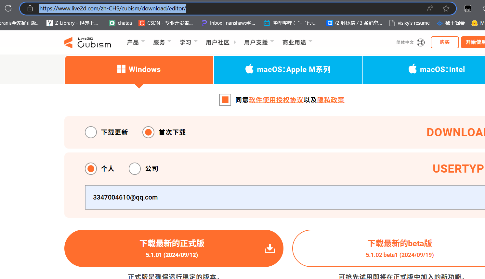
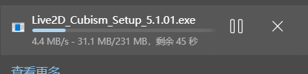
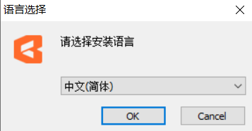
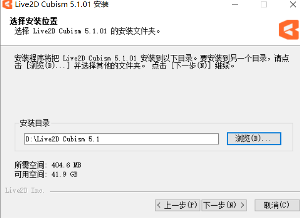
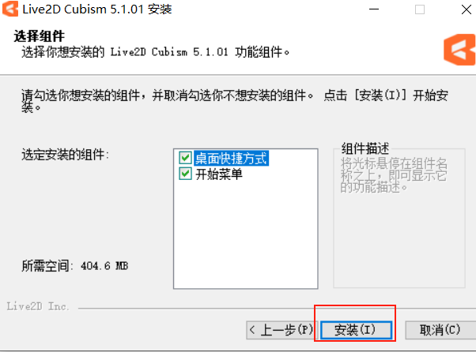

# 安装live2d

官网：[下载Live2D Cubism Editor | Live2D Cubism](https://www.live2d.com/zh-CHS/cubism/download/editor/)

## 第一步：到官网上把安装包下载到本地

## 第二步：打开exe文件

## 第三步：选一下安装目录

## 第四步：点击安装即可

然后咱们打开Live2D Cubism Editor就可以进行编辑了

